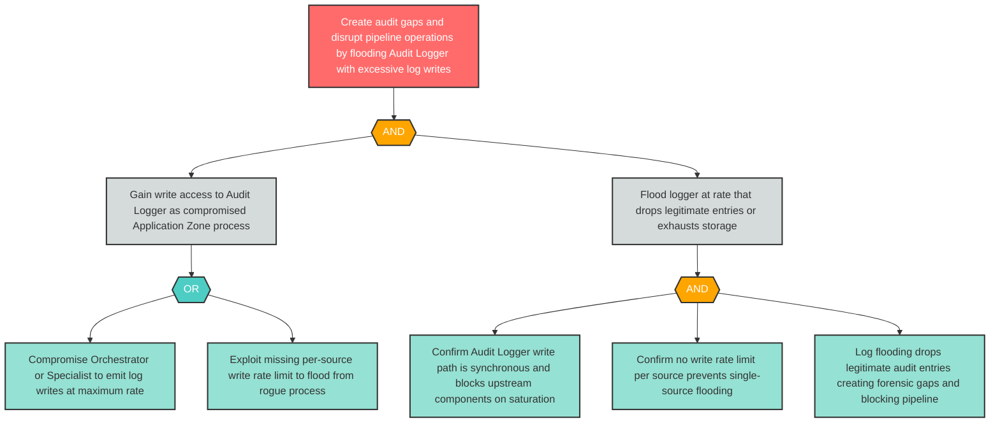

# Attack Tree: D-7 — Log-Flooding Attack Creates Audit Gaps and Blocks Pipeline Operations

**Finding ID**: D-7
**Risk Level**: High
**Component**: Audit Logger
**Delta Status**: UNCHANGED

```mermaid
flowchart TD
    D7_root["Create audit gaps and disrupt pipeline operations by flooding Audit Logger with excessive log writes"]
    D7_and1{{"AND"}}
    D7_sub1["Gain write access to Audit Logger as compromised Application Zone process"]
    D7_sub2["Flood logger at rate that drops legitimate entries or exhausts storage"]
    D7_or1{{"OR"}}
    D7_leaf1["Compromise Orchestrator or Specialist to emit log writes at maximum rate"]
    D7_leaf2["Exploit missing per-source write rate limit to flood from rogue process"]
    D7_and2{{"AND"}}
    D7_leaf3["Confirm Audit Logger write path is synchronous and blocks upstream components on saturation"]
    D7_leaf4["Confirm no write rate limit per source prevents single-source flooding"]
    D7_leaf5["Log flooding drops legitimate audit entries creating forensic gaps and blocking pipeline"]

    D7_root --> D7_and1
    D7_and1 --> D7_sub1
    D7_and1 --> D7_sub2
    D7_sub1 --> D7_or1
    D7_or1 --> D7_leaf1
    D7_or1 --> D7_leaf2
    D7_sub2 --> D7_and2
    D7_and2 --> D7_leaf3
    D7_and2 --> D7_leaf4
    D7_and2 --> D7_leaf5

    classDef goal fill:#ff6b6b,stroke:#333,stroke-width:2px,color:#fff
    classDef andGate fill:#ffa500,stroke:#333,stroke-width:2px,color:#fff
    classDef orGate fill:#4ecdc4,stroke:#333,stroke-width:2px,color:#fff
    classDef subGoal fill:#d5dbdb,stroke:#333,stroke-width:2px,color:#333
    classDef leaf fill:#95e1d3,stroke:#333,stroke-width:2px,color:#333

    class D7_root goal
    class D7_and1,D7_and2 andGate
    class D7_or1 orGate
    class D7_sub1,D7_sub2 subGoal
    class D7_leaf1,D7_leaf2,D7_leaf3,D7_leaf4,D7_leaf5 leaf
```
