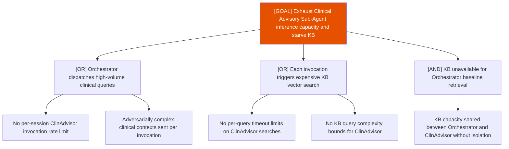

# Attack Tree: D-9 — Clinical Advisory Sub-Agent

**Risk Level**: High
**Component**: Clinical Advisory Sub-Agent
**Threat**: High-volume clinical queries exhaust sub-agent inference and starve KB

