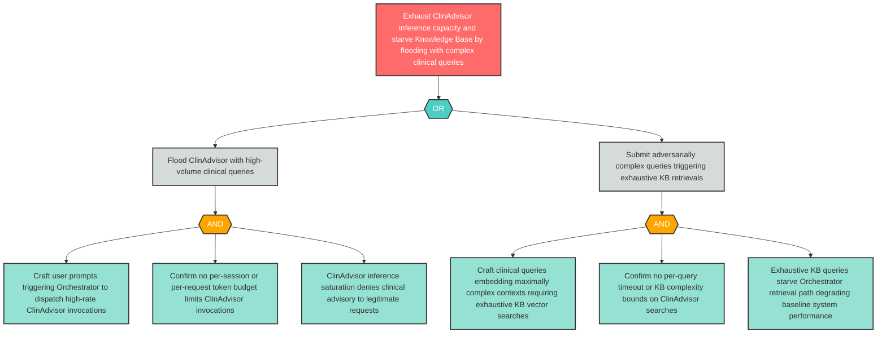

# Attack Tree: D-9 — High-Volume Clinical Queries Exhaust ClinAdvisor Capacity and Starve KB

**Finding ID**: D-9
**Risk Level**: High
**Component**: Clinical Advisory Sub-Agent
**Delta Status**: UNCHANGED

