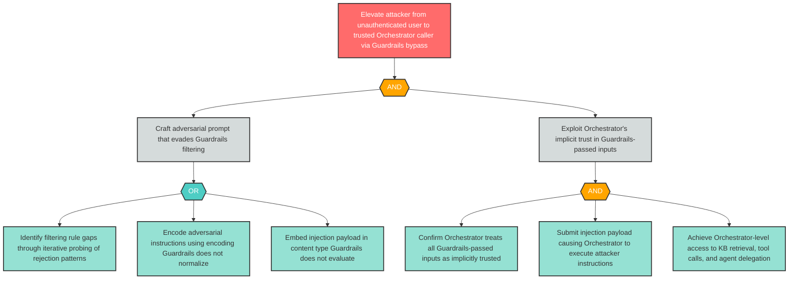

# Attack Tree: E-1 — Prompt Injection Bypass Elevates Attacker to Trusted Orchestrator Caller

**Finding ID**: E-1
**Risk Level**: Critical
**Component**: Guardrails Service
**Delta Status**: UNCHANGED

