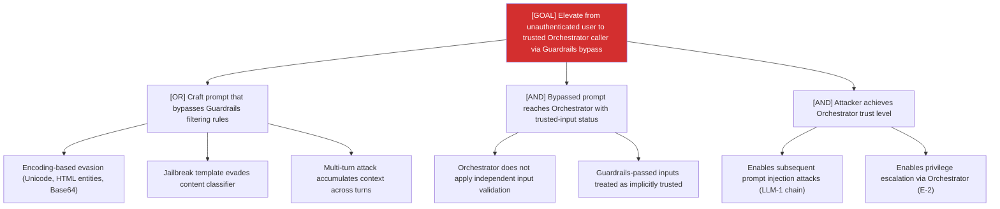

# Attack Tree: E-1 — Guardrails Service

**Risk Level**: Critical
**Component**: Guardrails Service
**Threat**: Prompt injection bypass elevates attacker to trusted Orchestrator caller

```mermaid
graph TD
    Goal["[GOAL] Elevate from unauthenticated user to trusted Orchestrator caller via Guardrails bypass"]
    Goal --> A["[OR] Craft prompt that bypasses Guardrails filtering rules"]
    A --> A1["Encoding-based evasion (Unicode, HTML entities, Base64)"]
    A --> A2["Jailbreak template evades content classifier"]
    A --> A3["Multi-turn attack accumulates context across turns"]
    Goal --> B["[AND] Bypassed prompt reaches Orchestrator with trusted-input status"]
    B --> B1["Orchestrator does not apply independent input validation"]
    B --> B2["Guardrails-passed inputs treated as implicitly trusted"]
    Goal --> C["[AND] Attacker achieves Orchestrator trust level"]
    C --> C1["Enables subsequent prompt injection attacks (LLM-1 chain)"]
    C --> C2["Enables privilege escalation via Orchestrator (E-2)"]
    classDef critical fill:#d32f2f,color:#fff
    class Goal critical
```
