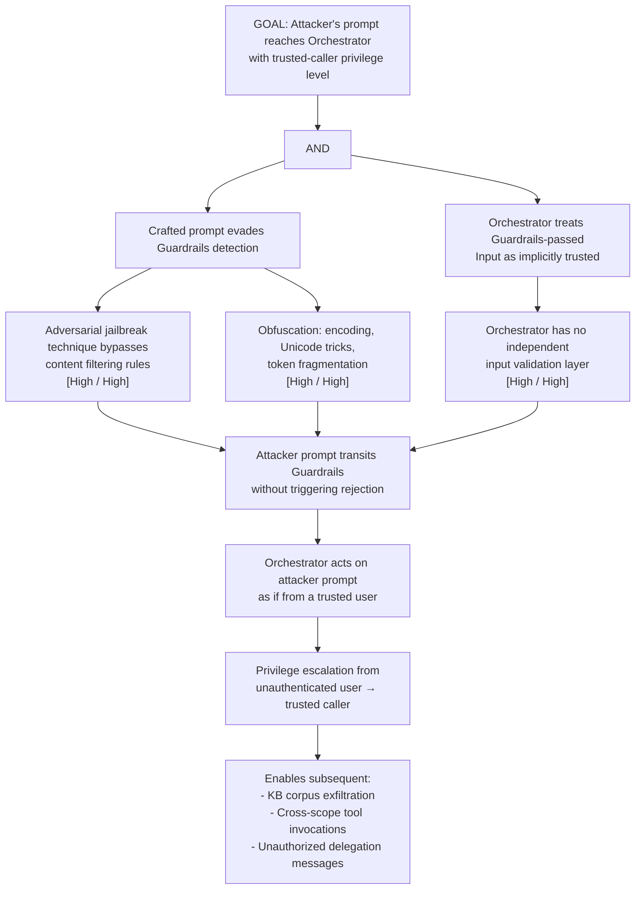

# Attack Tree: E-1 — Guardrails Service Prompt Injection Bypass Privilege Escalation

**Chain-breaking control**: Layer defense-in-depth: the Orchestrator MUST apply its own input validation independently of Guardrails. Do not treat Guardrails-passed inputs as implicitly trusted. Implement Orchestrator-level prompt injection detection as a separate control.
