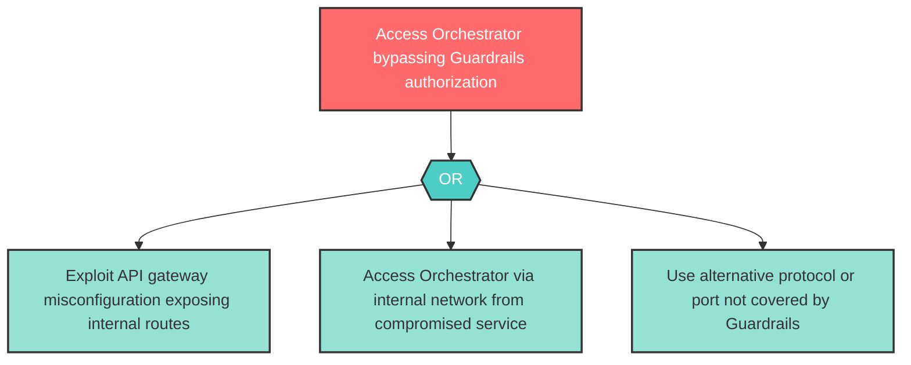

# Attack Tree: E-1 -- Guardrails Bypass via Alternate Route

| Field | Value |
|-------|-------|
| Finding ID | E-1 |
| Component | Guardrails Service |
| Risk Level | High |
| Threat | Guardrails Bypass via Alternate Route |
| Correlation | None |

