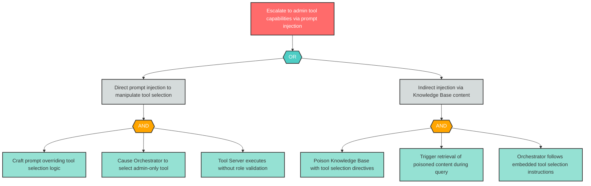

# Attack Tree: E-2 -- Privilege Escalation via Tool Selection Manipulation

| Field | Value |
|-------|-------|
| Finding ID | E-2 |
| Component | LLM Agent Orchestrator |
| Risk Level | Critical |
| Threat | Privilege Escalation via Tool Selection Manipulation |
| Correlation | CG-2 (See also: AG-1) |

