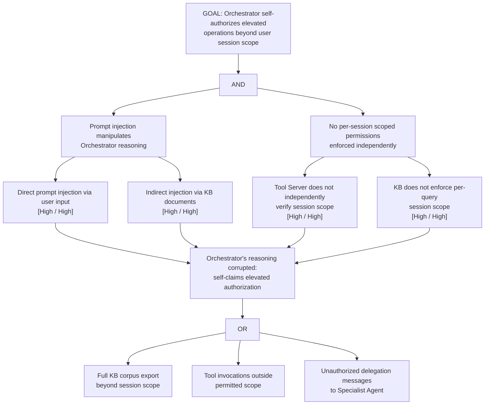

# Attack Tree: E-2 — LLM Agent Orchestrator Self-Authorized Privilege Escalation

**Chain-breaking control**: Implement per-session scoped permissions for the Orchestrator determined at authentication time and enforced by the Tool Server and KB independently. The Orchestrator MUST NOT grant itself elevated capabilities at runtime. Apply step-up authentication for high-privilege operations.
