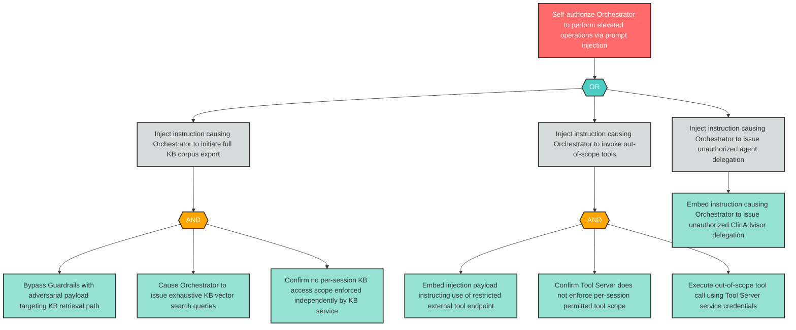

# Attack Tree: E-2 — Prompt Injection Self-Authorizes Orchestrator to Perform Elevated Operations

**Finding ID**: E-2
**Risk Level**: Critical
**Component**: LLM Agent Orchestrator
**Delta Status**: UNCHANGED

