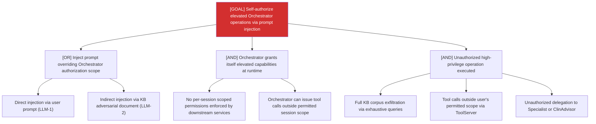

# Attack Tree: E-2 — LLM Agent Orchestrator

**Risk Level**: Critical
**Component**: LLM Agent Orchestrator
**Threat**: Prompt injection self-authorizes elevated operations

```mermaid
graph TD
    Goal["[GOAL] Self-authorize elevated Orchestrator operations via prompt injection"]
    Goal --> A["[OR] Inject prompt overriding Orchestrator authorization scope"]
    A --> A1["Direct injection via user prompt (LLM-1)"]
    A --> A2["Indirect injection via KB adversarial document (LLM-2)"]
    Goal --> B["[AND] Orchestrator grants itself elevated capabilities at runtime"]
    B --> B1["No per-session scoped permissions enforced by downstream services"]
    B --> B2["Orchestrator can issue tool calls outside permitted session scope"]
    Goal --> C["[AND] Unauthorized high-privilege operation executed"]
    C --> C1["Full KB corpus exfiltration via exhaustive queries"]
    C --> C2["Tool calls outside user's permitted scope via ToolServer"]
    C --> C3["Unauthorized delegation to Specialist or ClinAdvisor"]
    classDef critical fill:#d32f2f,color:#fff
    class Goal critical
```
