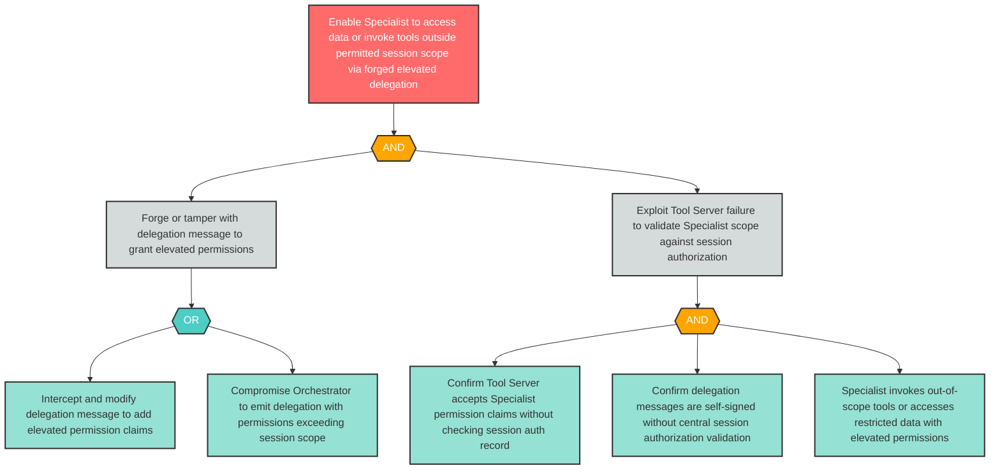

# Attack Tree: E-3 — Forged Delegation Grants Specialist Elevated Permissions Beyond Session Scope

**Finding ID**: E-3
**Risk Level**: High
**Component**: Specialist Agent
**Delta Status**: UNCHANGED

