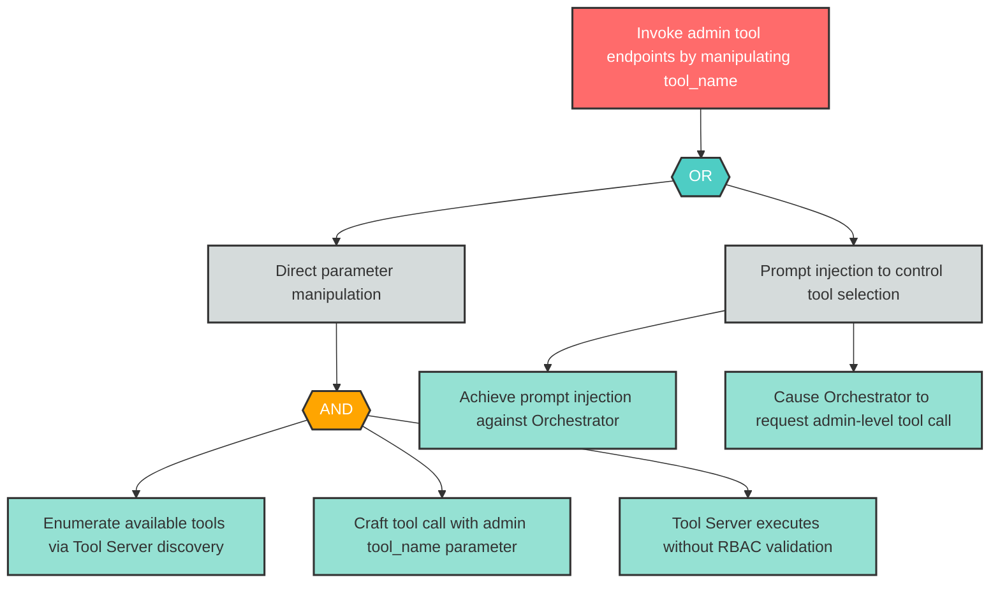

# Attack Tree: E-3 -- Administrative Tool Access via Parameter Manipulation

| Field | Value |
|-------|-------|
| Finding ID | E-3 |
| Component | MCP Tool Server |
| Risk Level | Critical |
| Threat | Administrative Tool Access via Parameter Manipulation |
| Correlation | None |

