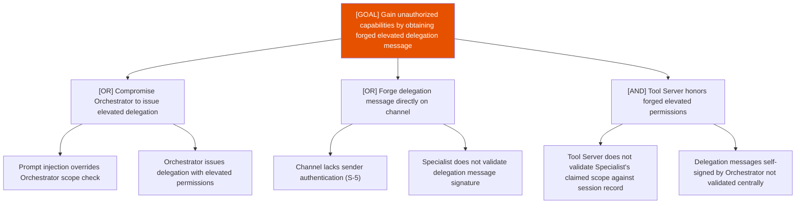

# Attack Tree: E-3 — Specialist Agent

**Risk Level**: High
**Component**: Specialist Agent
**Threat**: Forged delegation grants Specialist permissions beyond session scope

```mermaid
graph TD
    Goal["[GOAL] Gain unauthorized capabilities by obtaining forged elevated delegation message"]
    Goal --> A["[OR] Compromise Orchestrator to issue elevated delegation"]
    A --> A1["Prompt injection overrides Orchestrator scope check"]
    A --> A2["Orchestrator issues delegation with elevated permissions"]
    Goal --> B["[OR] Forge delegation message directly on channel"]
    B --> B1["Channel lacks sender authentication (S-5)"]
    B --> B2["Specialist does not validate delegation message signature"]
    Goal --> C["[AND] Tool Server honors forged elevated permissions"]
    C --> C1["Tool Server does not validate Specialist's claimed scope against session record"]
    C --> C2["Delegation messages self-signed by Orchestrator not validated centrally"]
    classDef high fill:#e65100,color:#fff
    class Goal high
```
