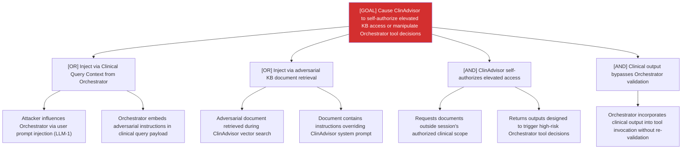

# Attack Tree: E-7 — Clinical Advisory Sub-Agent

**Risk Level**: Critical
**Component**: Clinical Advisory Sub-Agent
**Threat**: Prompt injection via clinical query elevates sub-agent to self-authorize elevated KB access

