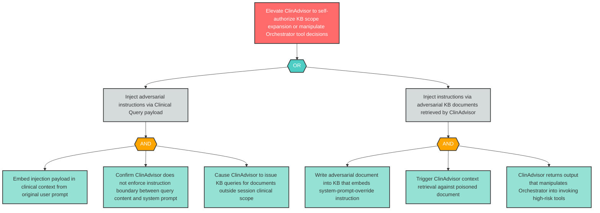

# Attack Tree: E-7 — Prompt Injection via Clinical Query Elevates ClinAdvisor to Unauthorized Scope

**Finding ID**: E-7
**Risk Level**: Critical
**Component**: Clinical Advisory Sub-Agent
**Delta Status**: UNCHANGED

