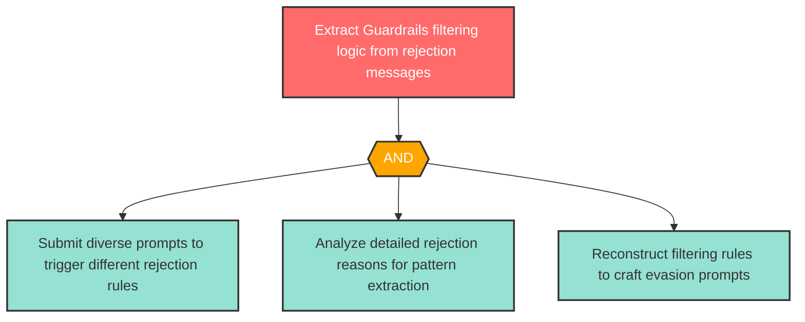

# Attack Tree: I-1 -- Filter Rule Disclosure via Rejection Messages

| Field | Value |
|-------|-------|
| Finding ID | I-1 |
| Component | Guardrails Service |
| Risk Level | High |
| Threat | Filter Rule Disclosure via Rejection Messages |
| Correlation | None |

