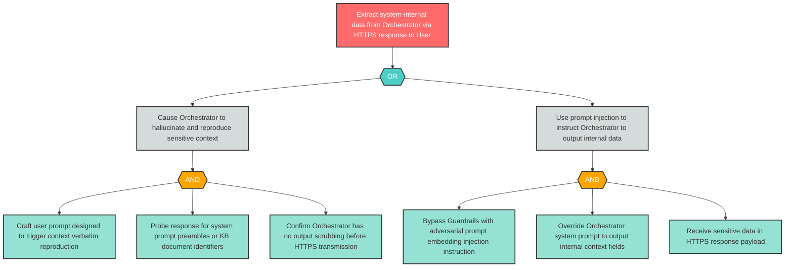

# Attack Tree: I-2 — Orchestrator Context Window Leaked in HTTPS Response via Hallucination or Injection

**Finding ID**: I-2
**Risk Level**: Critical
**Component**: LLM Agent Orchestrator
**Delta Status**: UNCHANGED

