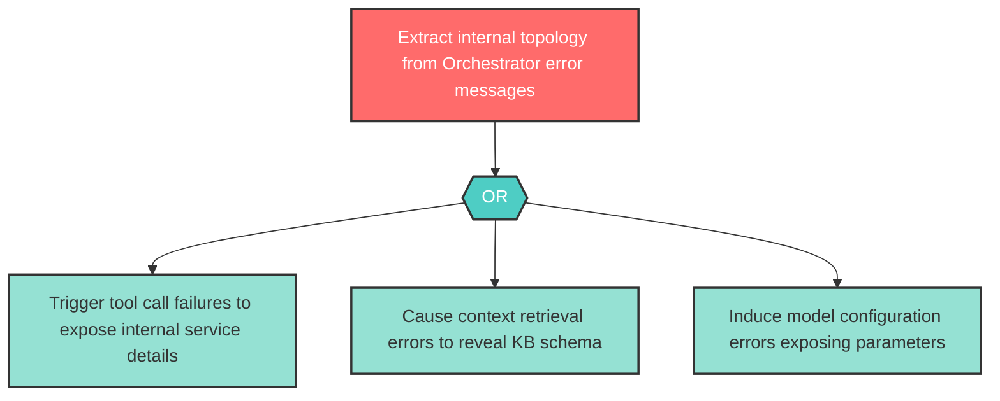

# Attack Tree: I-2 -- Internal State Leakage via Error Messages

| Field | Value |
|-------|-------|
| Finding ID | I-2 |
| Component | LLM Agent Orchestrator |
| Risk Level | High |
| Threat | Internal State Leakage via Error Messages |
| Correlation | None |

