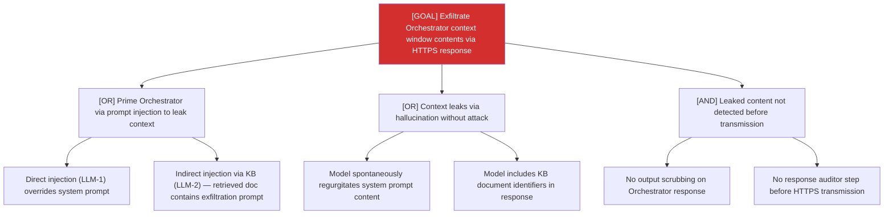

# Attack Tree: I-2 — LLM Agent Orchestrator

**Risk Level**: Critical
**Component**: LLM Agent Orchestrator
**Threat**: Context window leaked in HTTPS response via hallucination or injection

```mermaid
graph TD
    Goal["[GOAL] Exfiltrate Orchestrator context window contents via HTTPS response"]
    Goal --> A["[OR] Prime Orchestrator via prompt injection to leak context"]
    A --> A1["Direct injection (LLM-1) overrides system prompt"]
    A --> A2["Indirect injection via KB (LLM-2) — retrieved doc contains exfiltration prompt"]
    Goal --> B["[OR] Context leaks via hallucination without attack"]
    B --> B1["Model spontaneously regurgitates system prompt content"]
    B --> B2["Model includes KB document identifiers in response"]
    Goal --> C["[AND] Leaked content not detected before transmission"]
    C --> C1["No output scrubbing on Orchestrator response"]
    C --> C2["No response auditor step before HTTPS transmission"]
    classDef critical fill:#d32f2f,color:#fff
    class Goal critical
```
