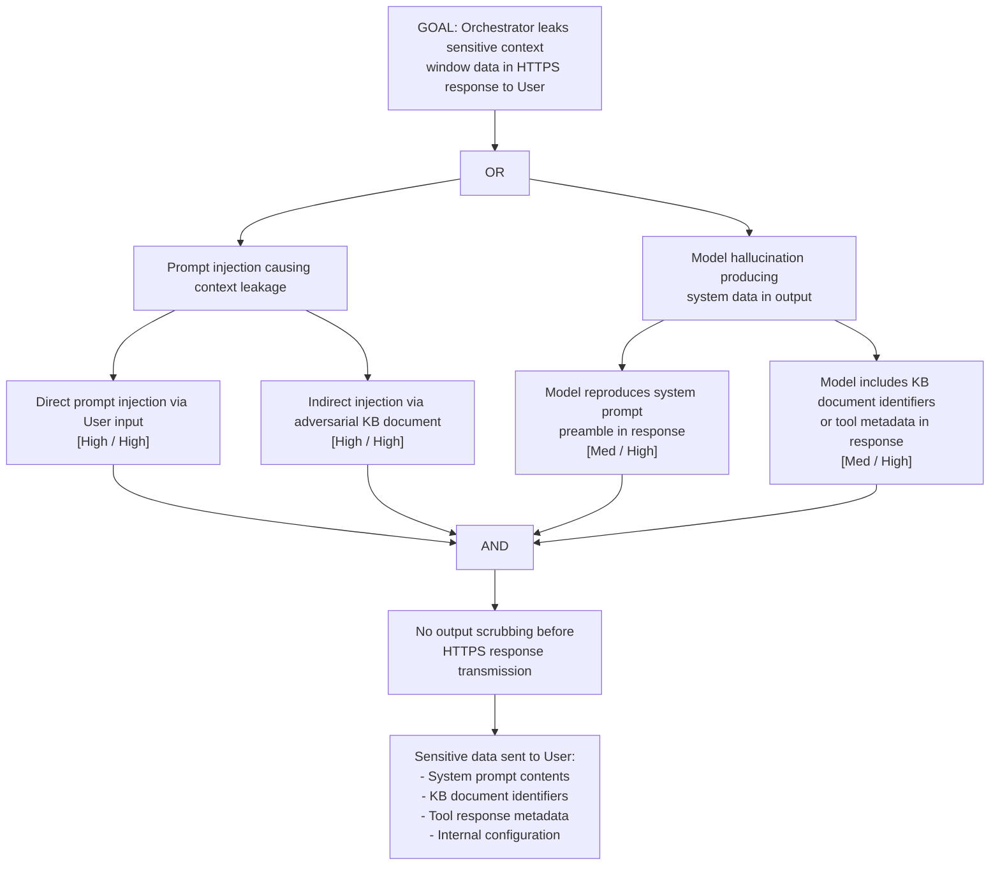

# Attack Tree: I-2 — LLM Agent Orchestrator Context Window Leakage

**Chain-breaking control**: Implement output scrubbing on the Orchestrator's response before transmission to the User: detect and redact content pattern-matching against known sensitive-data markers. Apply a separate "response auditor" step that reviews the output before sending.
