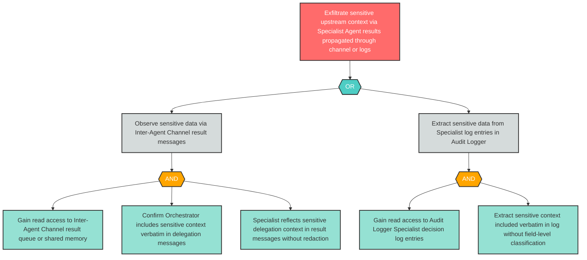

# Attack Tree: I-3 — Sensitive Delegation Context Leaked via Specialist Results in Channel or Logs

**Finding ID**: I-3
**Risk Level**: High
**Component**: Specialist Agent
**Delta Status**: UNCHANGED

