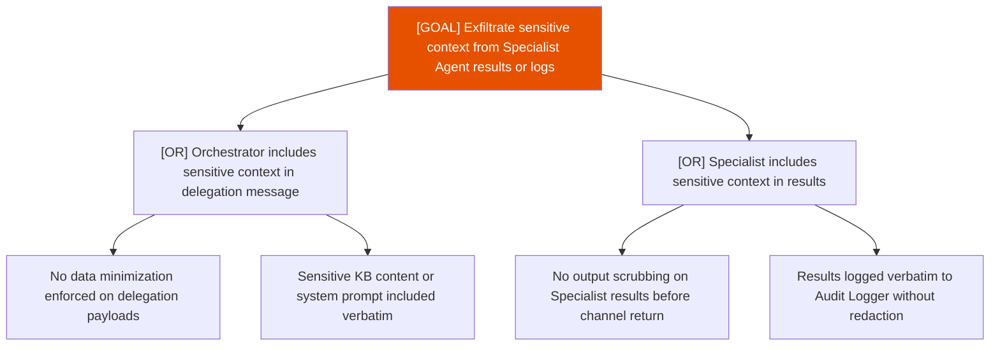

# Attack Tree: I-3 — Specialist Agent

**Risk Level**: High
**Component**: Specialist Agent
**Threat**: Sensitive delegation context leaked in Specialist results via channel or logs

```mermaid
graph TD
    Goal["[GOAL] Exfiltrate sensitive context from Specialist Agent results or logs"]
    Goal --> A["[OR] Orchestrator includes sensitive context in delegation message"]
    A --> A1["No data minimization enforced on delegation payloads"]
    A --> A2["Sensitive KB content or system prompt included verbatim"]
    Goal --> B["[OR] Specialist includes sensitive context in results"]
    B --> B1["No output scrubbing on Specialist results before channel return"]
    B --> B2["Results logged verbatim to Audit Logger without redaction"]
    classDef high fill:#e65100,color:#fff
    class Goal high
```
