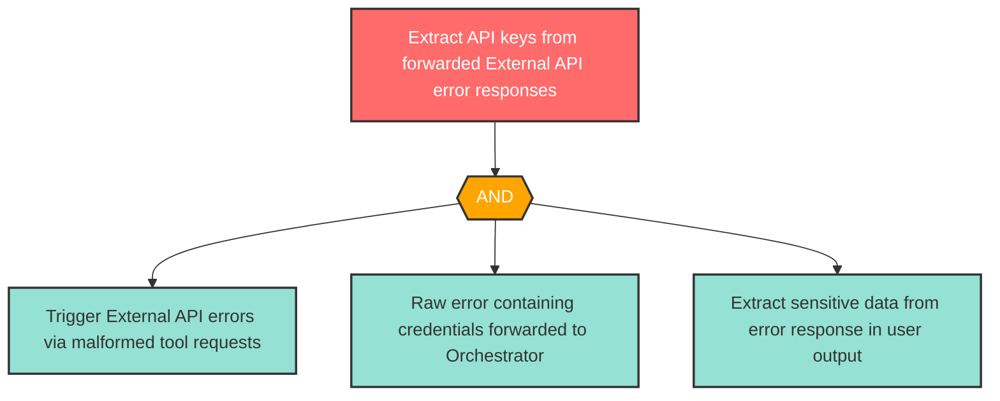

# Attack Tree: I-3 -- API Key Exposure via Unsanitized Error Forwarding

| Field | Value |
|-------|-------|
| Finding ID | I-3 |
| Component | MCP Tool Server |
| Risk Level | High |
| Threat | API Key Exposure via Unsanitized Error Forwarding |
| Correlation | None |

