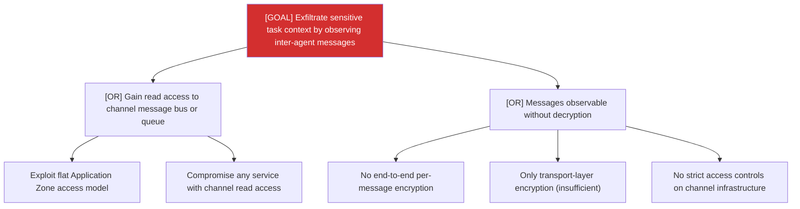

# Attack Tree: I-4 — Inter-Agent Communication Channel

**Risk Level**: Critical
**Component**: Inter-Agent Communication Channel
**Threat**: Inter-agent messages observable to unauthorized Application Zone processes

