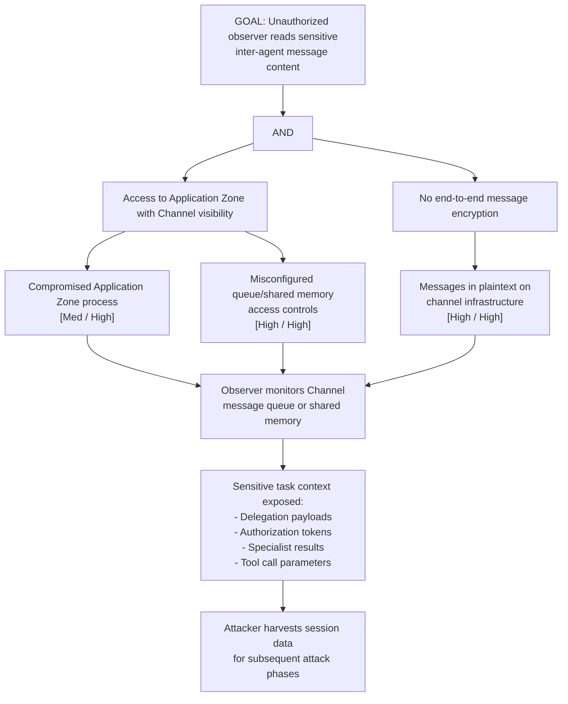

# Attack Tree: I-4 — Inter-Agent Channel Message Interception

**Chain-breaking control**: Encrypt all inter-agent messages end-to-end (not just at the transport layer). Implement per-message encryption with keys derived from the sender-receiver pair. Apply strict access controls on the channel infrastructure.
