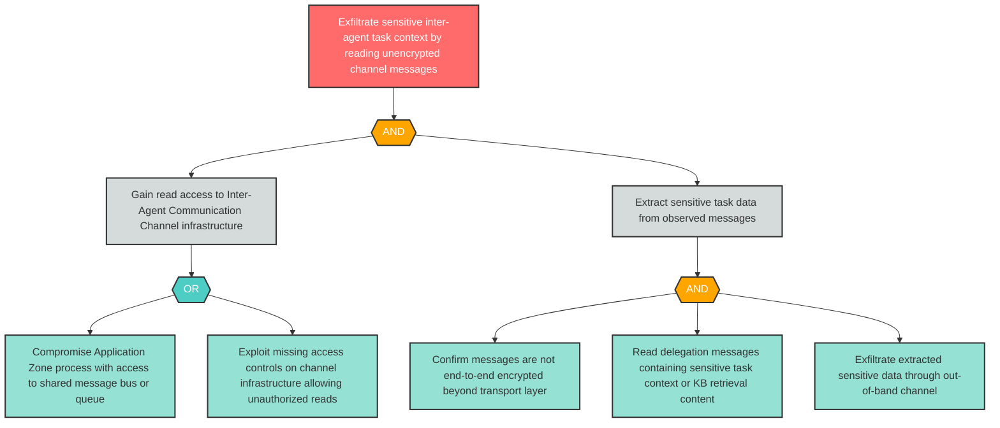

# Attack Tree: I-4 — Inter-Agent Messages Observable to Unauthorized Application Zone Processes

**Finding ID**: I-4
**Risk Level**: Critical
**Component**: Inter-Agent Communication Channel
**Delta Status**: UNCHANGED

