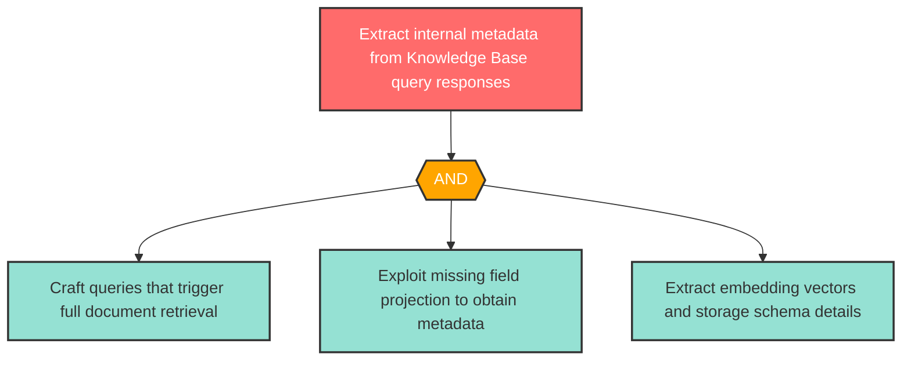

# Attack Tree: I-4 -- Knowledge Base Metadata Exposure

| Field | Value |
|-------|-------|
| Finding ID | I-4 |
| Component | Knowledge Base |
| Risk Level | High |
| Threat | Knowledge Base Metadata Exposure |
| Correlation | None |

