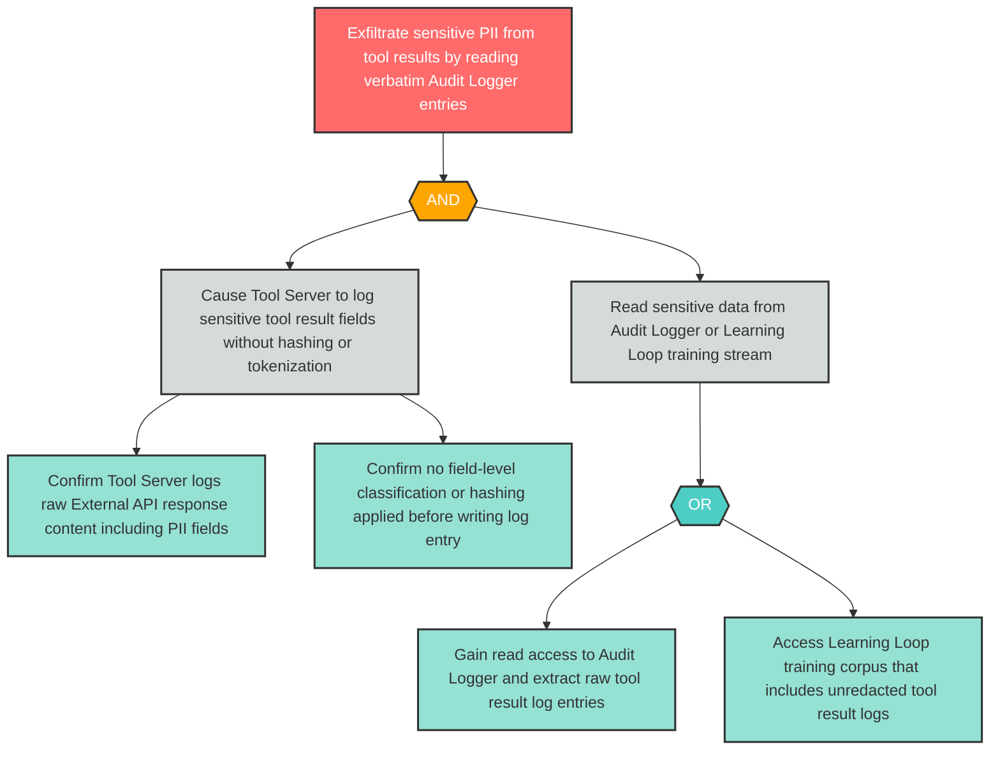

# Attack Tree: I-5 — Tool Results Containing PII Logged Verbatim to Audit Logger

**Finding ID**: I-5
**Risk Level**: High
**Component**: MCP Tool Server
**Delta Status**: UNCHANGED

```mermaid
flowchart TD
    I5_root["Exfiltrate sensitive PII from tool results by reading verbatim Audit Logger entries"]
    I5_and1{{"AND"}}
    I5_sub1["Cause Tool Server to log sensitive tool result fields without hashing or tokenization"]
    I5_sub2["Read sensitive data from Audit Logger or Learning Loop training stream"]
    I5_leaf1["Confirm Tool Server logs raw External API response content including PII fields"]
    I5_leaf2["Confirm no field-level classification or hashing applied before writing log entry"]
    I5_or1{{"OR"}}
    I5_leaf3["Gain read access to Audit Logger and extract raw tool result log entries"]
    I5_leaf4["Access Learning Loop training corpus that includes unredacted tool result logs"]

    I5_root --> I5_and1
    I5_and1 --> I5_sub1
    I5_and1 --> I5_sub2
    I5_sub1 --> I5_leaf1
    I5_sub1 --> I5_leaf2
    I5_sub2 --> I5_or1
    I5_or1 --> I5_leaf3
    I5_or1 --> I5_leaf4

    classDef goal fill:#ff6b6b,stroke:#333,stroke-width:2px,color:#fff
    classDef andGate fill:#ffa500,stroke:#333,stroke-width:2px,color:#fff
    classDef orGate fill:#4ecdc4,stroke:#333,stroke-width:2px,color:#fff
    classDef subGoal fill:#d5dbdb,stroke:#333,stroke-width:2px,color:#333
    classDef leaf fill:#95e1d3,stroke:#333,stroke-width:2px,color:#333

    class I5_root goal
    class I5_and1 andGate
    class I5_or1 orGate
    class I5_sub1,I5_sub2 subGoal
    class I5_leaf1,I5_leaf2,I5_leaf3,I5_leaf4 leaf
```
