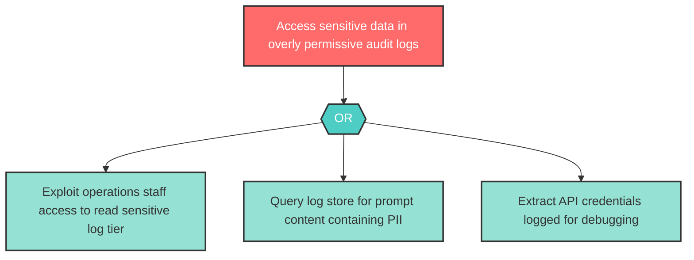

# Attack Tree: I-5 -- Sensitive Data in Audit Logs

| Field | Value |
|-------|-------|
| Finding ID | I-5 |
| Component | Audit Logger |
| Risk Level | High |
| Threat | Sensitive Data in Audit Logs |
| Correlation | None |

