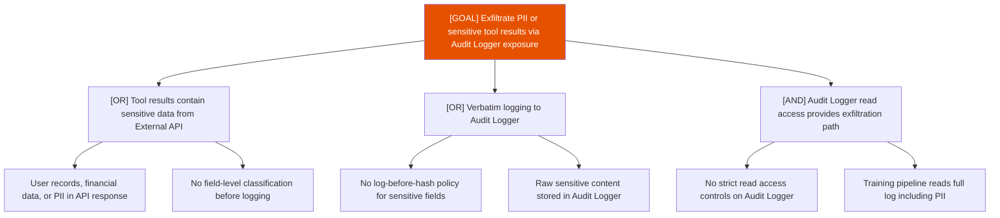

# Attack Tree: I-5 — MCP Tool Server

**Risk Level**: High
**Component**: MCP Tool Server
**Threat**: Tool results containing PII logged verbatim to Audit Logger

```mermaid
graph TD
    Goal["[GOAL] Exfiltrate PII or sensitive tool results via Audit Logger exposure"]
    Goal --> A["[OR] Tool results contain sensitive data from External API"]
    A --> A1["User records, financial data, or PII in API response"]
    A --> A2["No field-level classification before logging"]
    Goal --> B["[OR] Verbatim logging to Audit Logger"]
    B --> B1["No log-before-hash policy for sensitive fields"]
    B --> B2["Raw sensitive content stored in Audit Logger"]
    Goal --> C["[AND] Audit Logger read access provides exfiltration path"]
    C --> C1["No strict read access controls on Audit Logger"]
    C --> C2["Training pipeline reads full log including PII"]
    classDef high fill:#e65100,color:#fff
    class Goal high
```
