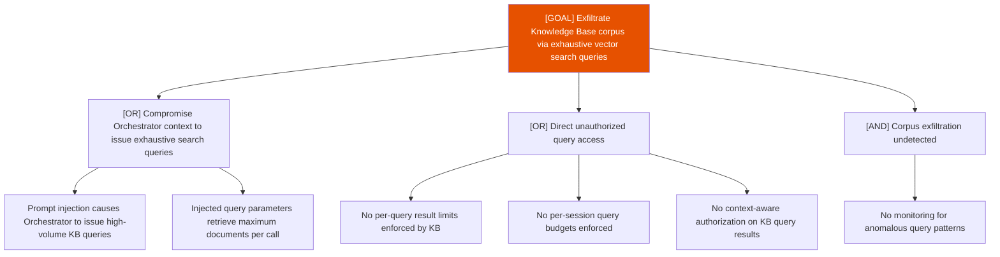

# Attack Tree: I-6 — Knowledge Base

**Risk Level**: High
**Component**: Knowledge Base
**Threat**: Full corpus exfiltration via unrestricted vector search queries

```mermaid
graph TD
    Goal["[GOAL] Exfiltrate Knowledge Base corpus via exhaustive vector search queries"]
    Goal --> A["[OR] Compromise Orchestrator context to issue exhaustive search queries"]
    A --> A1["Prompt injection causes Orchestrator to issue high-volume KB queries"]
    A --> A2["Injected query parameters retrieve maximum documents per call"]
    Goal --> B["[OR] Direct unauthorized query access"]
    B --> B1["No per-query result limits enforced by KB"]
    B --> B2["No per-session query budgets enforced"]
    B --> B3["No context-aware authorization on KB query results"]
    Goal --> C["[AND] Corpus exfiltration undetected"]
    C --> C1["No monitoring for anomalous query patterns"]
    classDef high fill:#e65100,color:#fff
    class Goal high
```
