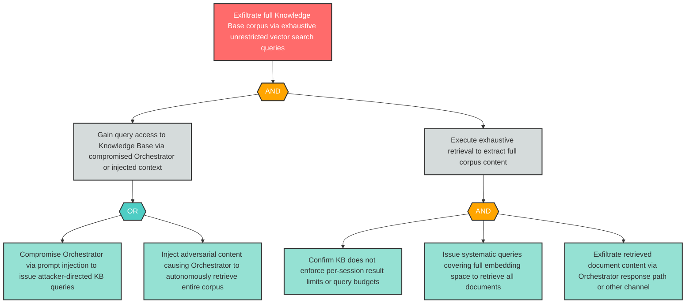

# Attack Tree: I-6 — Full KB Corpus Exfiltrated via Unrestricted Vector Search Queries

**Finding ID**: I-6
**Risk Level**: High
**Component**: Knowledge Base
**Delta Status**: UNCHANGED

```mermaid
flowchart TD
    I6_root["Exfiltrate full Knowledge Base corpus via exhaustive unrestricted vector search queries"]
    I6_and1{{"AND"}}
    I6_sub1["Gain query access to Knowledge Base via compromised Orchestrator or injected context"]
    I6_sub2["Execute exhaustive retrieval to extract full corpus content"]
    I6_or1{{"OR"}}
    I6_leaf1["Compromise Orchestrator via prompt injection to issue attacker-directed KB queries"]
    I6_leaf2["Inject adversarial content causing Orchestrator to autonomously retrieve entire corpus"]
    I6_and2{{"AND"}}
    I6_leaf3["Confirm KB does not enforce per-session result limits or query budgets"]
    I6_leaf4["Issue systematic queries covering full embedding space to retrieve all documents"]
    I6_leaf5["Exfiltrate retrieved document content via Orchestrator response path or other channel"]

    I6_root --> I6_and1
    I6_and1 --> I6_sub1
    I6_and1 --> I6_sub2
    I6_sub1 --> I6_or1
    I6_or1 --> I6_leaf1
    I6_or1 --> I6_leaf2
    I6_sub2 --> I6_and2
    I6_and2 --> I6_leaf3
    I6_and2 --> I6_leaf4
    I6_and2 --> I6_leaf5

    classDef goal fill:#ff6b6b,stroke:#333,stroke-width:2px,color:#fff
    classDef andGate fill:#ffa500,stroke:#333,stroke-width:2px,color:#fff
    classDef orGate fill:#4ecdc4,stroke:#333,stroke-width:2px,color:#fff
    classDef subGoal fill:#d5dbdb,stroke:#333,stroke-width:2px,color:#333
    classDef leaf fill:#95e1d3,stroke:#333,stroke-width:2px,color:#333

    class I6_root goal
    class I6_and1,I6_and2 andGate
    class I6_or1 orGate
    class I6_sub1,I6_sub2 subGoal
    class I6_leaf1,I6_leaf2,I6_leaf3,I6_leaf4,I6_leaf5 leaf
```
