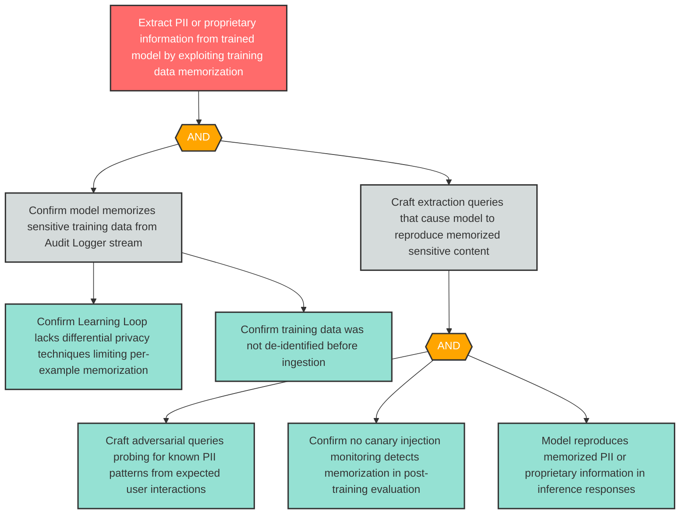

# Attack Tree: I-8 — Model Memorizes Training PII Enabling Training Data Extraction

**Finding ID**: I-8
**Risk Level**: High
**Component**: Long-Running Learning Loop
**Delta Status**: UNCHANGED

```mermaid
flowchart TD
    I8_root["Extract PII or proprietary information from trained model by exploiting training data memorization"]
    I8_and1{{"AND"}}
    I8_sub1["Confirm model memorizes sensitive training data from Audit Logger stream"]
    I8_sub2["Craft extraction queries that cause model to reproduce memorized sensitive content"]
    I8_leaf1["Confirm Learning Loop lacks differential privacy techniques limiting per-example memorization"]
    I8_leaf2["Confirm training data was not de-identified before ingestion"]
    I8_and2{{"AND"}}
    I8_leaf3["Craft adversarial queries probing for known PII patterns from expected user interactions"]
    I8_leaf4["Confirm no canary injection monitoring detects memorization in post-training evaluation"]
    I8_leaf5["Model reproduces memorized PII or proprietary information in inference responses"]

    I8_root --> I8_and1
    I8_and1 --> I8_sub1
    I8_and1 --> I8_sub2
    I8_sub1 --> I8_leaf1
    I8_sub1 --> I8_leaf2
    I8_sub2 --> I8_and2
    I8_and2 --> I8_leaf3
    I8_and2 --> I8_leaf4
    I8_and2 --> I8_leaf5

    classDef goal fill:#ff6b6b,stroke:#333,stroke-width:2px,color:#fff
    classDef andGate fill:#ffa500,stroke:#333,stroke-width:2px,color:#fff
    classDef orGate fill:#4ecdc4,stroke:#333,stroke-width:2px,color:#fff
    classDef subGoal fill:#d5dbdb,stroke:#333,stroke-width:2px,color:#333
    classDef leaf fill:#95e1d3,stroke:#333,stroke-width:2px,color:#333

    class I8_root goal
    class I8_and1,I8_and2 andGate
    class I8_sub1,I8_sub2 subGoal
    class I8_leaf1,I8_leaf2,I8_leaf3,I8_leaf4,I8_leaf5 leaf
```
