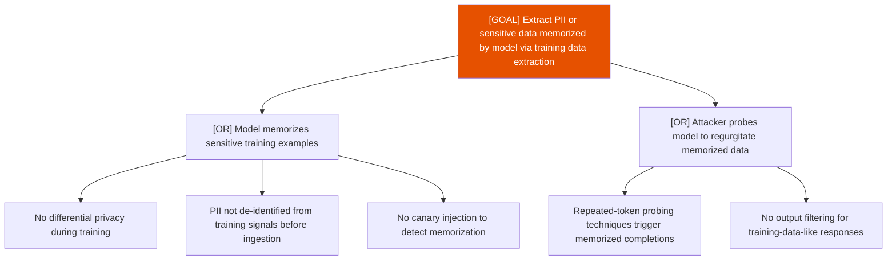

# Attack Tree: I-8 — Long-Running Learning Loop

**Risk Level**: High
**Component**: Long-Running Learning Loop
**Threat**: Model memorizes training data PII enabling extraction attack

```mermaid
graph TD
    Goal["[GOAL] Extract PII or sensitive data memorized by model via training data extraction"]
    Goal --> A["[OR] Model memorizes sensitive training examples"]
    A --> A1["No differential privacy during training"]
    A --> A2["PII not de-identified from training signals before ingestion"]
    A --> A3["No canary injection to detect memorization"]
    Goal --> B["[OR] Attacker probes model to regurgitate memorized data"]
    B --> B1["Repeated-token probing techniques trigger memorized completions"]
    B --> B2["No output filtering for training-data-like responses"]
    classDef high fill:#e65100,color:#fff
    class Goal high
```
