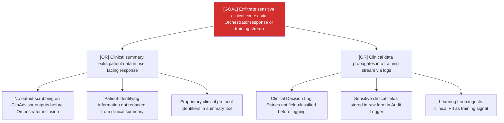

# Attack Tree: I-9 — Clinical Advisory Sub-Agent

**Risk Level**: Critical
**Component**: Clinical Advisory Sub-Agent
**Threat**: Clinical context leaks in response or training stream

```mermaid
graph TD
    Goal["[GOAL] Exfiltrate sensitive clinical context via Orchestrator response or training stream"]
    Goal --> A["[OR] Clinical summary leaks patient data in user-facing response"]
    A --> A1["No output scrubbing on ClinAdvisor outputs before Orchestrator inclusion"]
    A --> A2["Patient-identifying information not redacted from clinical summary"]
    A --> A3["Proprietary clinical protocol identifiers in summary text"]
    Goal --> B["[OR] Clinical data propagates into training stream via logs"]
    B --> B1["Clinical Decision Log Entries not field-classified before logging"]
    B --> B2["Sensitive clinical fields stored in raw form in Audit Logger"]
    B --> B3["Learning Loop ingests clinical PII as training signal"]
    classDef critical fill:#d32f2f,color:#fff
    class Goal critical
```
