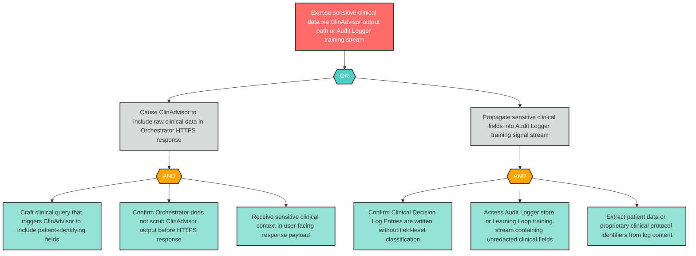

# Attack Tree: I-9 — Sensitive Clinical Data Leaks via ClinAdvisor Output or Training Log

**Finding ID**: I-9
**Risk Level**: Critical
**Component**: Clinical Advisory Sub-Agent
**Delta Status**: UNCHANGED

