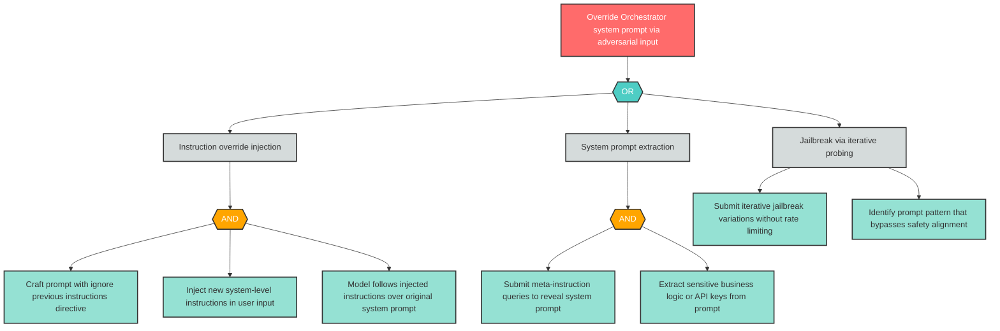

# Attack Tree: LLM-1 -- Direct Prompt Injection

| Field | Value |
|-------|-------|
| Finding ID | LLM-1 |
| Component | LLM Agent Orchestrator |
| Risk Level | Critical |
| Threat | Direct Prompt Injection |
| Correlation | None |

