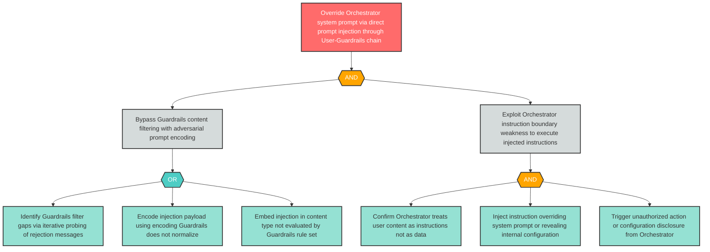

# Attack Tree: LLM-1 — Direct Prompt Injection Overrides Orchestrator System Prompt

**Finding ID**: LLM-1
**Risk Level**: Critical
**Component**: LLM Agent Orchestrator
**Delta Status**: UNCHANGED

