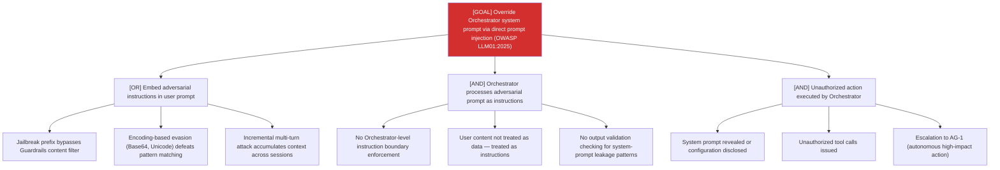

# Attack Tree: LLM-1 — LLM Agent Orchestrator

**Risk Level**: Critical
**Component**: LLM Agent Orchestrator
**Threat**: Direct prompt injection overrides system prompt or reveals configuration

```mermaid
graph TD
    Goal["[GOAL] Override Orchestrator system prompt via direct prompt injection (OWASP LLM01:2025)"]
    Goal --> A["[OR] Embed adversarial instructions in user prompt"]
    A --> A1["Jailbreak prefix bypasses Guardrails content filter"]
    A --> A2["Encoding-based evasion (Base64, Unicode) defeats pattern matching"]
    A --> A3["Incremental multi-turn attack accumulates context across sessions"]
    Goal --> B["[AND] Orchestrator processes adversarial prompt as instructions"]
    B --> B1["No Orchestrator-level instruction boundary enforcement"]
    B --> B2["User content not treated as data — treated as instructions"]
    B --> B3["No output validation checking for system-prompt leakage patterns"]
    Goal --> C["[AND] Unauthorized action executed by Orchestrator"]
    C --> C1["System prompt revealed or configuration disclosed"]
    C --> C2["Unauthorized tool calls issued"]
    C --> C3["Escalation to AG-1 (autonomous high-impact action)"]
    classDef critical fill:#d32f2f,color:#fff
    class Goal critical
```
