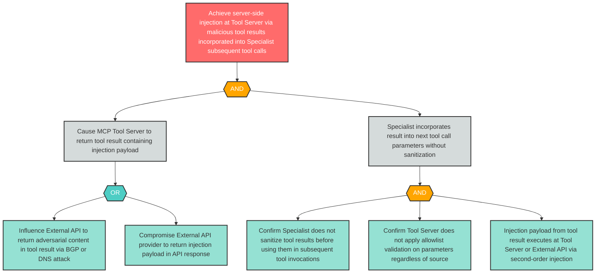

# Attack Tree: LLM-10 — Server-Side Injection via Tool Result Incorporation into Subsequent Tool Calls

**Finding ID**: LLM-10
**Risk Level**: High
**Component**: Specialist Agent
**Delta Status**: UNCHANGED

