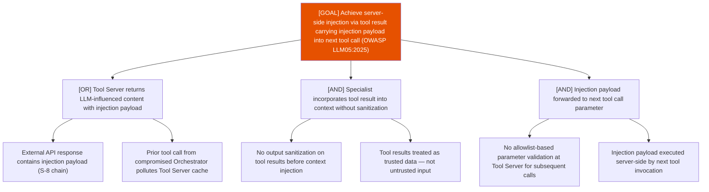

# Attack Tree: LLM-10 — Specialist Agent

**Risk Level**: High
**Component**: Specialist Agent
**Threat**: Server-side injection via tool result incorporation into subsequent tool calls

```mermaid
graph TD
    Goal["[GOAL] Achieve server-side injection via tool result carrying injection payload into next tool call (OWASP LLM05:2025)"]
    Goal --> A["[OR] Tool Server returns LLM-influenced content with injection payload"]
    A --> A1["External API response contains injection payload (S-8 chain)"]
    A --> A2["Prior tool call from compromised Orchestrator pollutes Tool Server cache"]
    Goal --> B["[AND] Specialist incorporates tool result into context without sanitization"]
    B --> B1["No output sanitization on tool results before context injection"]
    B --> B2["Tool results treated as trusted data — not untrusted input"]
    Goal --> C["[AND] Injection payload forwarded to next tool call parameter"]
    C --> C1["No allowlist-based parameter validation at Tool Server for subsequent calls"]
    C --> C2["Injection payload executed server-side by next tool invocation"]
    classDef high fill:#e65100,color:#fff
    class Goal high
```
