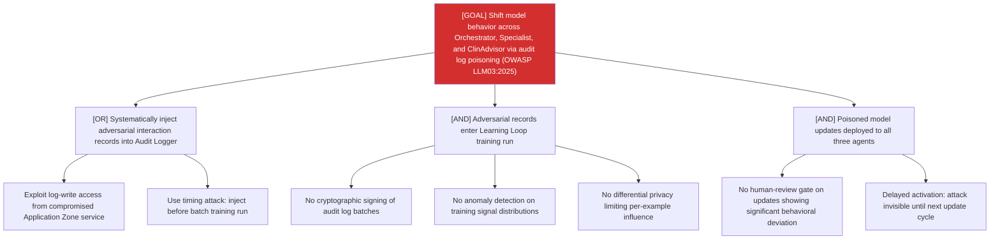

# Attack Tree: LLM-11 — Long-Running Learning Loop

**Risk Level**: Critical
**Component**: Long-Running Learning Loop
**Threat**: Systematic audit log poisoning for delayed temporal model behavioral shift (OWASP LLM03:2025)

