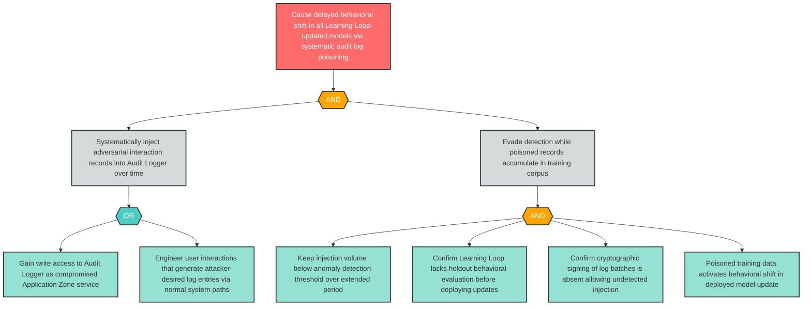

# Attack Tree: LLM-11 — Systematic Audit Log Poisoning for Delayed Temporal Model Behavioral Shift

**Finding ID**: LLM-11
**Risk Level**: Critical
**Component**: Long-Running Learning Loop
**Delta Status**: UNCHANGED

