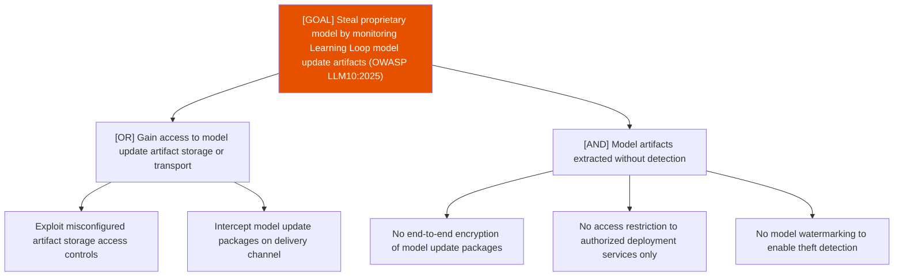

# Attack Tree: LLM-12 — Long-Running Learning Loop

**Risk Level**: High
**Component**: Long-Running Learning Loop
**Threat**: Model theft via Learning Loop output artifact monitoring

```mermaid
graph TD
    Goal["[GOAL] Steal proprietary model by monitoring Learning Loop model update artifacts (OWASP LLM10:2025)"]
    Goal --> A["[OR] Gain access to model update artifact storage or transport"]
    A --> A1["Exploit misconfigured artifact storage access controls"]
    A --> A2["Intercept model update packages on delivery channel"]
    Goal --> B["[AND] Model artifacts extracted without detection"]
    B --> B1["No end-to-end encryption of model update packages"]
    B --> B2["No access restriction to authorized deployment services only"]
    B --> B3["No model watermarking to enable theft detection"]
    classDef high fill:#e65100,color:#fff
    class Goal high
```
