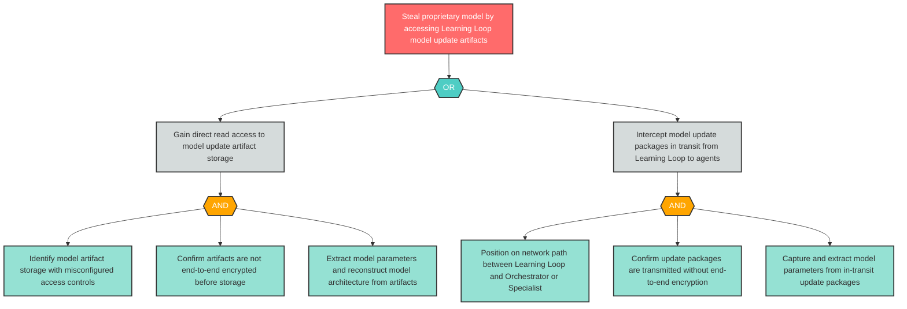

# Attack Tree: LLM-12 — Model Theft via Learning Loop Output Artifact Monitoring

**Finding ID**: LLM-12
**Risk Level**: High
**Component**: Long-Running Learning Loop
**Delta Status**: UNCHANGED

```mermaid
flowchart TD
    LLM12_root["Steal proprietary model by accessing Learning Loop model update artifacts"]
    LLM12_or1{{"OR"}}
    LLM12_sub1["Gain direct read access to model update artifact storage"]
    LLM12_sub2["Intercept model update packages in transit from Learning Loop to agents"]
    LLM12_and1{{"AND"}}
    LLM12_leaf1["Identify model artifact storage with misconfigured access controls"]
    LLM12_leaf2["Confirm artifacts are not end-to-end encrypted before storage"]
    LLM12_leaf3["Extract model parameters and reconstruct model architecture from artifacts"]
    LLM12_and2{{"AND"}}
    LLM12_leaf4["Position on network path between Learning Loop and Orchestrator or Specialist"]
    LLM12_leaf5["Confirm update packages are transmitted without end-to-end encryption"]
    LLM12_leaf6["Capture and extract model parameters from in-transit update packages"]

    LLM12_root --> LLM12_or1
    LLM12_or1 --> LLM12_sub1
    LLM12_or1 --> LLM12_sub2
    LLM12_sub1 --> LLM12_and1
    LLM12_and1 --> LLM12_leaf1
    LLM12_and1 --> LLM12_leaf2
    LLM12_and1 --> LLM12_leaf3
    LLM12_sub2 --> LLM12_and2
    LLM12_and2 --> LLM12_leaf4
    LLM12_and2 --> LLM12_leaf5
    LLM12_and2 --> LLM12_leaf6

    classDef goal fill:#ff6b6b,stroke:#333,stroke-width:2px,color:#fff
    classDef andGate fill:#ffa500,stroke:#333,stroke-width:2px,color:#fff
    classDef orGate fill:#4ecdc4,stroke:#333,stroke-width:2px,color:#fff
    classDef subGoal fill:#d5dbdb,stroke:#333,stroke-width:2px,color:#333
    classDef leaf fill:#95e1d3,stroke:#333,stroke-width:2px,color:#333

    class LLM12_root goal
    class LLM12_or1 orGate
    class LLM12_and1,LLM12_and2 andGate
    class LLM12_sub1,LLM12_sub2 subGoal
    class LLM12_leaf1,LLM12_leaf2,LLM12_leaf3,LLM12_leaf4,LLM12_leaf5,LLM12_leaf6 leaf
```
