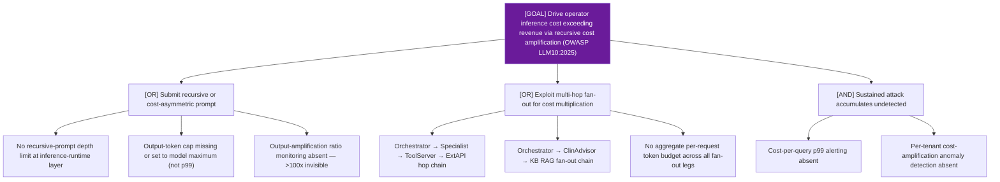

# Attack Tree: LLM-15 — LLM Agent Orchestrator

**Risk Level**: Critical
**Component**: LLM Agent Orchestrator
**Threat**: Cost amplification via recursive or cost-asymmetric prompting (OWASP LLM10:2025 Cat 10)

