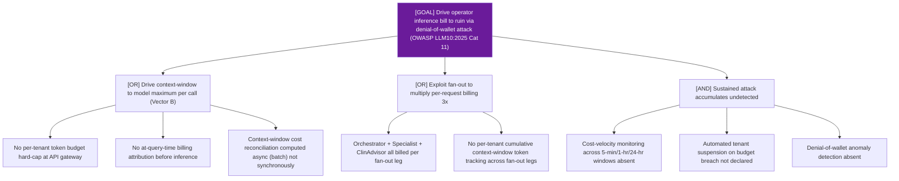

# Attack Tree: LLM-16 — LLM Agent Orchestrator

**Risk Level**: High
**Component**: LLM Agent Orchestrator
**Threat**: Denial-of-Wallet via context-window cost amplification (OWASP LLM10:2025 Cat 11)

