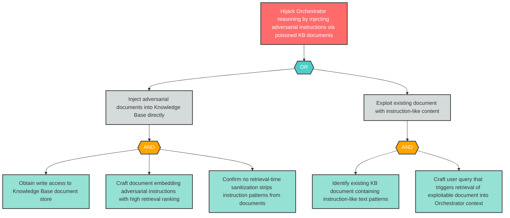

# Attack Tree: LLM-2 — Indirect Prompt Injection via Adversarial Knowledge Base Documents

**Finding ID**: LLM-2
**Risk Level**: Critical
**Component**: LLM Agent Orchestrator
**Delta Status**: UNCHANGED

