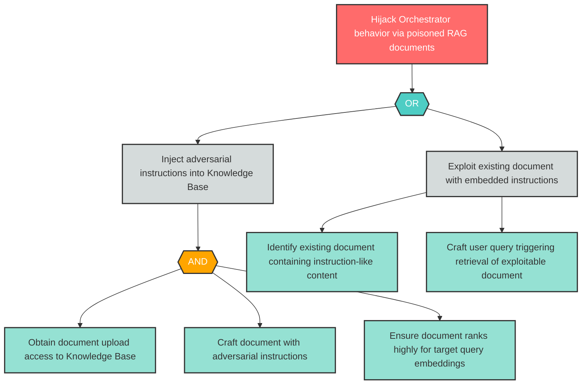

# Attack Tree: LLM-2 -- Indirect Prompt Injection via RAG Pipeline

| Field | Value |
|-------|-------|
| Finding ID | LLM-2 |
| Component | LLM Agent Orchestrator |
| Risk Level | High |
| Threat | Indirect Prompt Injection via RAG Pipeline |
| Correlation | CG-1 (See also: T-4) |

